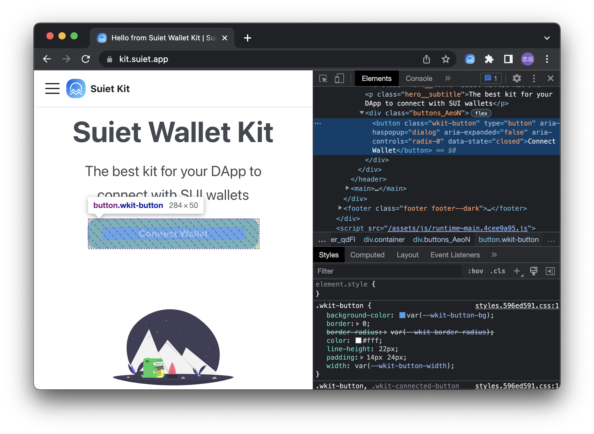

# Styling

## BEM Naming Rule

The BEM naming rule is used to name CSS classes. It is a convention for naming CSS classes in a consistent and predictable way. It helps to achieve reusable components and code sharing in front-end development.

```txt
.wkit-[block]__[element]--[modifier]
```

```jsx
<div className={"wkit-button"}>...</div>
```

## Import default CSS

You need to import the default css file to use the default styles.

:::caution
You may need a proper CSS loader to import CSS files. See [Webpack](https://webpack.js.org/loaders/css-loader/) or [Vite](https://vitejs.dev/guide/features.html#css) for more information.
:::

For example, import the default css file in the `src/index.jsx` file:

```jsx title="src/index.jsx"
import * as React from "react";
import "@suiet/wallet-kit/style.css"; // Add this line to your code

// Your Application code below
function App() {
  return <div>...</div>;
}
```

## Customize & Theme

### CSS Variables

This section describes how to use CSS variables to customize the theme of the components.

We use CSS variables to define colors, and other styles like below:

```css
:root {
  --wkit-accent-hs: 210, 100%;
  --wkit-on-accent-rgb: 255, 255, 255;
  --wkit-bg-rgb: 239, 241, 245;
  --wkit-on-bg-rgb: 10, 14, 34;
  --wkit-font-family: "Inter", sans-serif;
  --wkit-font-family-mono: "IBM Plex Mono", monospace;
  --wkit-font-size-large: 18px;
  --wkit-font-size-medium: 16px;
  --wkit-font-size-small: 14px;
  --wkit-line-height-large: 22px;
  --wkit-line-height-medium: 19px;
  --wkit-line-height-small: 17px;
  --wkit-button-width: 284px;
  --wkit-border-radius: 16px;
}
```

Below is a list of all CSS variables that you can use as public API to customize the look of the components.

| CSS Variables               | Descriptions                                           | Default Value                |
| --------------------------- | ------------------------------------------------------ | ---------------------------- |
| `--wkit-accent-hs`          | The hue and saturation components of the accent color. | `210, 100%`                  |
| `--wkit-on-accent-rgb`      | The RGB value of the color on the accent color.        | `255, 255, 255`              |
| `--wkit-bg-rgb`             | The RGB value of the background color.                 | `239, 241, 245`              |
| `--wkit-on-bg-rgb`          | The RGB value of the color on the background color.    | `10, 14, 34`                 |
| `--wkit-font-family`        | The font-family of the components.                     | `'Inter', sans-serif`        |
| `--wkit-font-family-mono`   | The font-family of the components (monospace).         | `'IBM Plex Mono', monospace` |
| `--wkit-font-size-large`    | The font-size of the components (L).                   | `18px`                       |
| `--wkit-font-size-medium`   | The font-size of the components (M).                   | `16px`                       |
| `--wkit-font-size-small`    | The font-size of the components (S).                   | `14px`                       |
| `--wkit-line-height-large`  | The line-height of the components (L).                 | `22px`                       |
| `--wkit-line-height-medium` | The line-height of the components (M).                 | `19px`                       |
| `--wkit-line-height-small`  | The line-height of the components (S).                 | `17px`                       |
| `--wkit-button-width`       | The width of the button.                               | `284px`                      |
| `--wkit-border-radius`      | The border radius of the components.                   | `16px`                       |

Default Values:

After figuring out the CSS variables you want to customize, you can override them in your own CSS file, like below:

```scss title="./suiet-wallet-kit-custom.css"
:root {
  --wkit-accent-hs: 110, 100%; // Redefine the hs (the first two components of hsl) of the accent color

  ... // other css variables
}
```

Import the default css file and your own css file in your application.

:::caution
The CSS variables must be imported **AFTER** importing the default css file.
:::

For example, in the `src/index.jsx` file:

```jsx title="src/index.jsx"
import "@suiet/wallet-kit/style.css";
import "./suiet-wallet-kit-custom.css"; // You css file here
```

### Override (Not recommended)

When CSS variables are not enough, you can customize the styles by importing the css file and overriding our default CSS rules.

:::caution
**Override our default CSS rules is not recommended because it is not easy to maintain.** If you have any questions or feature requests, please contact us.
:::

Fellow the steps below to customize the styles:

First, figure out the CSS class name of the component you want to customize. For example, the CSS class name of the `ConnectButton` component is `wkit-button`.



Then override the styles in your own CSS file.

```scss title="./suiet-wallet-kit-custom.css"
.wkit-button {
  height: 64px; // For example, override the height of the button
}
```

And last, import the default css file and your own css file in your application.

:::caution
Your CSS rules must be imported **AFTER** importing the default css file.
:::

For example, in the `src/index.jsx` file:

```jsx title="src/index.jsx"
import "@suiet/wallet-kit/style.css";
import "./suiet-wallet-kit-custom.css"; // You css file here
```

## Dark Mode

With the help of CSS variables, you can easily customize the theme of the components to support dark mode.

In fact, we have already provided a dark mode theme for you, no additional configuration is required.

:::tip
We also defined our dark mode theme under the `[data-theme='dark']:root` selector, as it is a common practice in the web development community.
:::

```scss
@media (prefers-color-scheme: dark) {
  :root {
    --wkit-accent-hs: 166, 91%;
    --wkit-on-accent-rgb: 255, 255, 255;
    --wkit-bg-rgb: 40, 40, 40;
    --wkit-on-bg-rgb: 241, 241, 241;
  }
}
```

Like normal mode, you can override the CSS variables above to customize the look of the components in dark mode. For example, you can change the accent color to red in dark mode:

```scss
@media (prefers-color-scheme: dark) {
  :root {
    --wkit-accent-hs: 0, 100%;
  }
}
```
